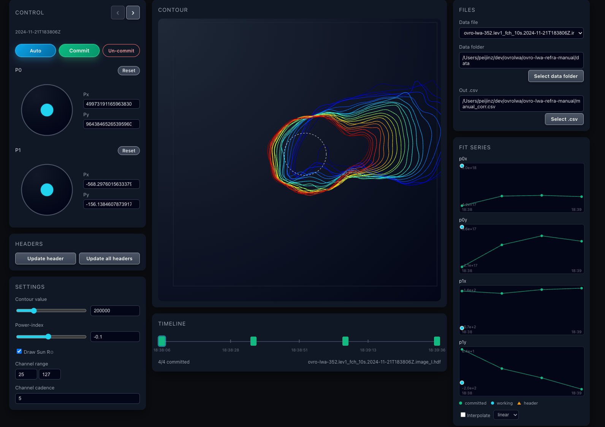

# OVRO-LWA Refraction Manual Correction Tool

Web app for interactively fitting **px0, py0, px1, py1** so that multi-frequency contour plots align across channels. The parameters define a per-channel spatial offset used in refraction correction:

- **x_offset** = px0 / f² + px1  
- **y_offset** = py0 / f² + py1  

where *f* is channel frequency. Results are written to a CSV (e.g. `manual_corr.csv`) keyed by observation time (UTC from the data filename).


---


---

## Background

At 13–87 MHz the apparent position of solar emission is displaced by frequency-dependent ionospheric refraction that scales approximately as 1/ν². The operational correction ([Zhang 2026, Zenodo](https://doi.org/10.5281/zenodo.22832312)) estimates the quiet-Sun disk centroid on each channel of a Level 1.0 multi-frequency cube, fits a two-parameter dispersion law per sky axis (`x = px0/f² + px1`, `y = py0/f² + py1`), and shifts every channel onto the fitted solar center. The real-time imaging pipeline applies this automatically (`lwasolarutl.refraction_corr`, `--do-refraction`); this app is its manual counterpart — inspect the cross-channel alignment yourself, adjust or auto-fit the four parameters, and build the correction table by hand.

---

## Setup

### 1. Download

```bash
git clone https://github.com/peijin94/ovro-lwa-refra-manual.git
cd ovro-lwa-refra-manual
```

### 2. Install dependencies

Requires Python 3.10+.

```bash
python -m venv .venv
source .venv/bin/activate  # Windows: .venv\Scripts\activate
pip install --upgrade pip
pip install -r requirements.txt
```

You only need Node.js if you want to develop the UI itself (see `frontend/README.md` for the Vite workflow). Plain users never need `npm`: the backend serves the prebuilt UI from `frontend/dist`.

### 3. Get data

Put HDF5 image cubes in the `data/` directory — or, once the app is running, point it at any other folder with **Select data folder**. Filenames should contain a UTC timestamp like `2024-11-21T183806Z` so commits match files.

### 4. Run the app

```bash
python starter.py
```

This starts the backend at `http://127.0.0.1:8989` and opens it in your default browser automatically. Useful options:

- `PORT=8080 python starter.py` (or `--port 8080`) — run on a different port.
- `python starter.py --no-browser` — don't open a browser on startup.

Then follow the User Guide below: pick a file, align the contours with **Auto** or the P0/P1 joysticks, **Commit** each frame, and optionally push the table back with **Update header(s)**.

---

## User Guide: How to Get px0, py0, px1, py1

### What you’re doing

You are choosing four numbers (**px0, py0, px1, py1**) so that when each channel’s contours are shifted by:

- **x_offset** = px0 / f² + px1  
- **y_offset** = py0 / f² + py1  

the contours line up across frequency. The middle panel shows the current contours with these offsets applied; you adjust P0 and P1 until the alignment looks good, then **Commit** to save that row to the CSV. The CSV is the gold standard: the plots and the timeline read from it, and header updates write from it.

### Layout

Three columns: controls left, plots middle, files + fit history right.

- **Control** (left): P0 and P1 joysticks and numeric Px/Py, **Previous/Next file** buttons with the current file name, **Auto** (automatic quiet-Sun fit, fills the working values), **Commit**, and **Un-commit** (removes the current file's CSV row).
- **Headers** (left, below Control): **Update header** writes the current file's CSV-committed row into its HDF header (`PX0/PY0/PX1/PY1`); **Update all headers** does this for every file with a CSV row.
- **Settings** (left): Contour value (slider 0–1e6) and power-index (slider −1–1), each with an exact-entry field; Draw Sun, channel range, channel cadence.
- **Contour** (middle): Multi-channel contours with the current px0, py0, px1, py1 applied. A dashed circle marks the solar disk at 1 R⊙ = 960 arcsec (if “Draw Sun R⊙” is on).
- **Timeline** (middle, below Contour): One clickable block per file ordered by the observation time read from each file's `DATE-OBS` header (filename timestamp as fallback). Green = committed to the CSV, hollow = pending, cyan ring = current file. Click a block to switch files.
- **Files** (right): Data file list, data folder (“Select data folder” re-reads every file header for the timeline), and output CSV path with **Select .csv** (in-app server file browser; the chosen table becomes the working file).
- **Fit series** (right, below Files): Four rows plotting **p0x, p0y, p1x, p1y** against observation time — green dots/line for committed CSV rows, a cyan dot for the current working values, and orange triangles for any px0/py0/px1/py1 found in the HDF file headers (checked on every folder load). The **Interpolate** switch at the bottom snaps the working values to the committed series (linear, last, or spline) whenever a frame without its own commit loads.

### Param sources

Three copies of the params exist, and the UI keeps them visually distinct:

- **Committed** — rows in the output CSV. Always in sync with the file on disk; plotted green in Fit series and as green timeline blocks.
- **Working** — the P0/P1 values in the frontend. Edits, joystick drags, and **Auto** only touch these (cyan dot); they vanish on reload unless committed.
- **Header** — `PX0/PY0/PX1/PY1` attributes inside each HDF file, written by **Update header(s)** from committed rows and plotted as orange triangles.

### Step-by-step: Obtaining and saving px0, py0, px1, py1

1. **Choose data and output CSV**  
   - In **Files**, pick the HDF5 **Data file** (and **Select data folder** if you need to change the data directory).  
   - Optionally pick an existing table with **Select .csv** (default is `./manual_corr.csv`).

2. **Tune contour display (Settings)**  
   - **Contour value**: Base contour level (blur to apply).  
   - **Power-index**: Exponent for scaling level with frequency (blur to apply).  
   - **Channel range** and **Channel cadence**: Which channels to show and how many to skip.  
   Use these so the contours are visible and not too crowded.

3. **Align contours with P0 and P1 (Control)**  
   - **P0** sets the frequency-dependent part of the offset (px0, py0).  
   - **P1** sets the constant part (px1, py1).  
   - Use the **joysticks** to drag, or type into **Px** and **Py** under P0 and P1.  
   - **Reset** sets that control’s values back to 0.  
   - Adjust until contours line up across frequency in the Contour panel.

4. **Save the parameters**  
   - Click **Commit**.  
   - The app writes one row to the output CSV: **Time** (UTC from the current data filename, no trailing “Z”), **px0, px1, py0, py1**.  
   - If a row with the same Time already exists, that row is updated instead of adding a duplicate.

5. **Move to the next file (optional)**  
   - Use **‹** / **›** in the Control header, the **Data file** dropdown, or click a block in the **Timeline** to change the data file.

6. **Repeat**  
   For each observation file, align contours, then **Commit**. The CSV accumulates (or updates) one row per time, giving you the **px0, py0, px1, py1** needed for refraction correction.

7. **Write back to headers (optional)**  
   - **Update header** stores the current file's committed CSV row as `PX0/PY0/PX1/PY1` header attributes so downstream tools can read the correction straight from the HDF file.  
   - **Update all headers** does this for every file that has a CSV row, skipping files without one. Only committed (CSV) values are ever written.

### Output CSV format

```csv
Time,px0,px1,py0,py1
2024-11-21T18:38:06,2.1132970174153646e+18,-4.3287509918212891e+02,-3.8650665283203130e+17,-6.7074890136718750e+01
```

- **Time**: UTC timestamp derived from the data filename (no “Z” suffix).  
- **px0, px1, py0, py1**: Scientific-notation values. Use them in your pipeline with **x_offset = px0/f² + px1**, **y_offset = py0/f² + py1** per channel frequency *f*.

### Tips

- **Select .csv** switches the working table: the timeline, fit-series plots, and header updates all follow the newly loaded file.
- If contours are missing or wrong, adjust **Contour value** and **Power-index** (and channel range/cadence) in Settings; changes apply after you blur the fields or change focus.  
- **Commit** uses the *current* data file’s timestamp. Use **‹** / **›** to select the correct file before committing.

---

## Summary

1. Put HDF5 files in `data/`, run backend and frontend.  
2. Select a **Data file** and optional **Out .csv** (via **Select .csv**).  
3. Adjust **Contour value** and **Settings** so contours are visible.  
4. Use **P0** and **P1** (joysticks or Px/Py) to align contours across frequency.  
5. Click **Commit** to write or update **Time, px0, px1, py0, py1** in the CSV.  
6. Use **‹** / **›** or the **Timeline** blocks to process more files and build the full correction table.  
7. Optionally push the table back into the data files with **Update header** / **Update all headers**.
